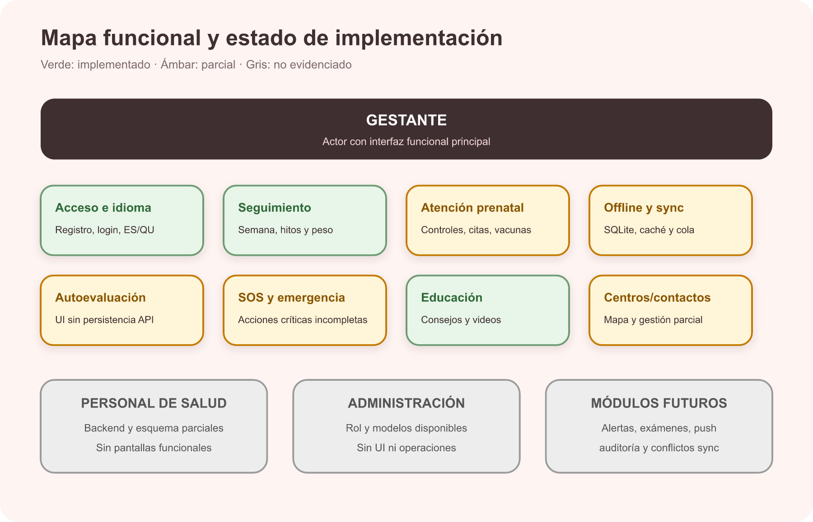
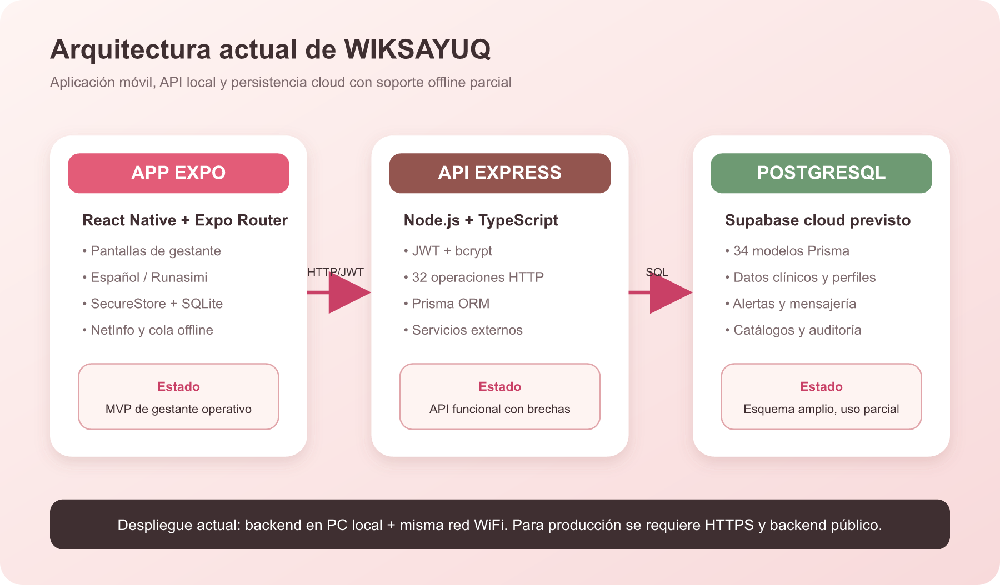
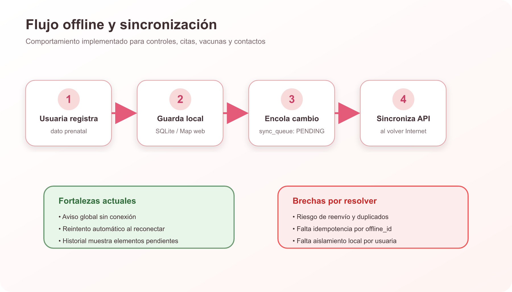
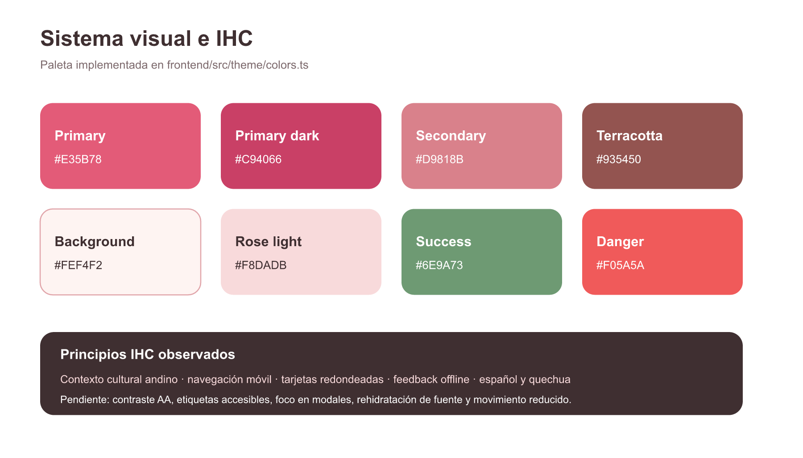
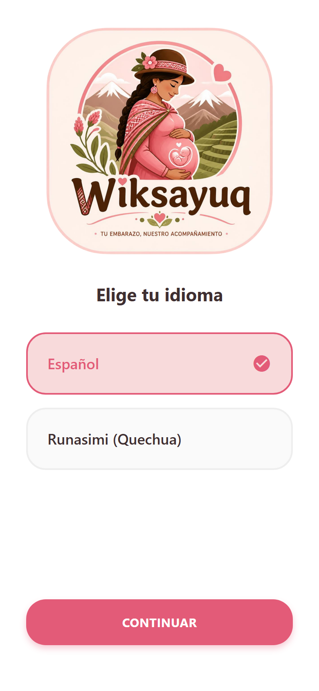
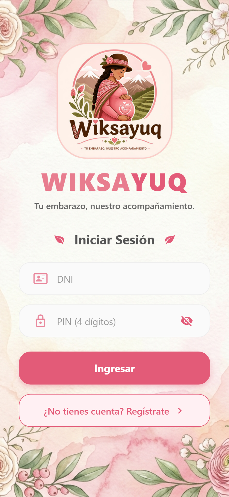
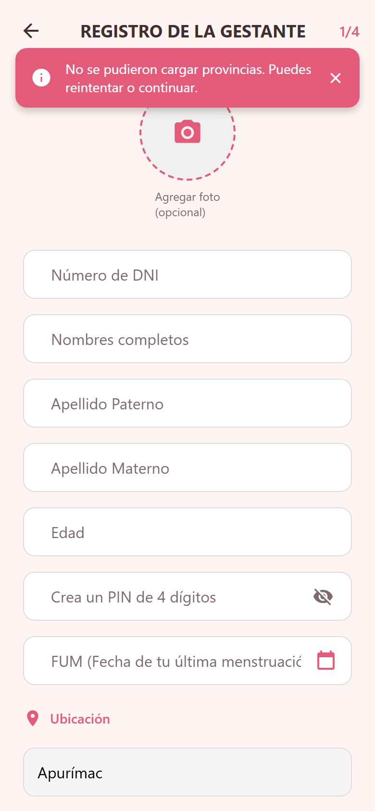
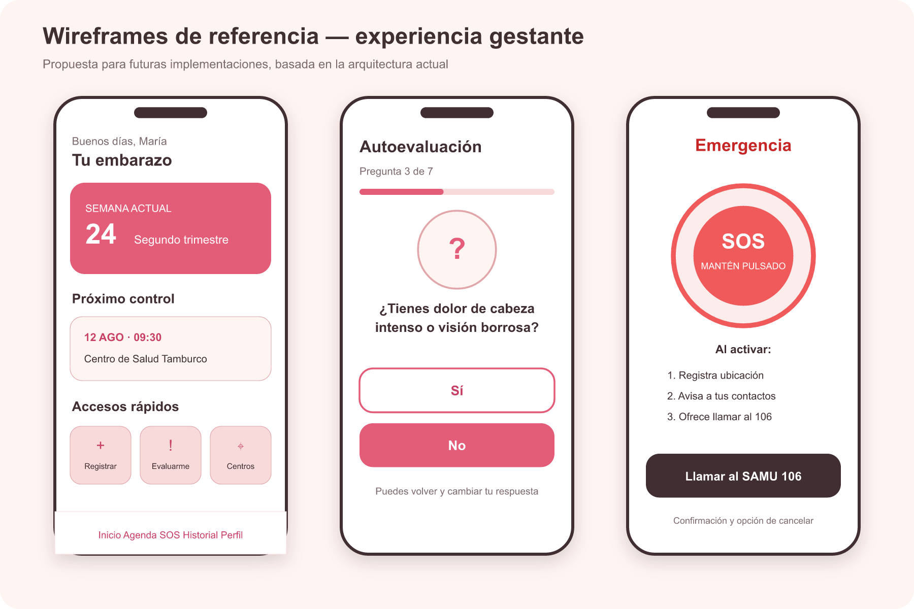
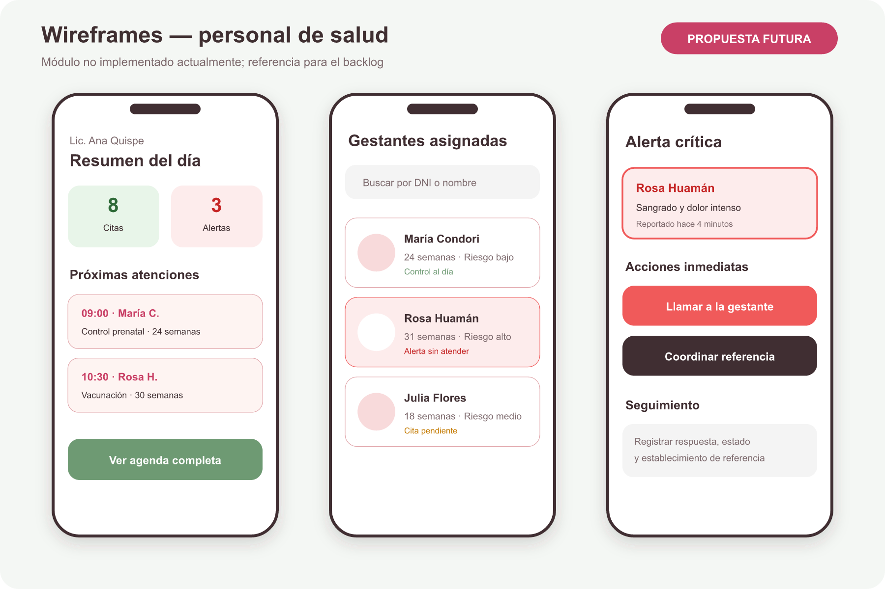

# WIKSAYUQ

## Informe integral del sistema, requisitos e IHC

**Fecha de corte:** 29 de julio de 2026  
**Versión analizada:** árbol de trabajo local actual  
**Propósito:** línea base para evaluación académica y futuras implementaciones.

> **Conclusión ejecutiva.** WIKSAYUQ es un MVP funcional centrado en la gestante. Permite acceso, seguimiento básico, calendario, historial, educación, contactos y operación offline parcial. Aún no está listo para producción clínica: el rol de personal de salud no tiene interfaz, SOS/autoevaluación no están integrados de extremo a extremo, la sincronización requiere idempotencia y faltan pruebas automatizadas.

## 1. Problema

Las gestantes de zonas altoandinas pueden enfrentar distancia geográfica, conectividad intermitente, barreras lingüísticas y fragmentación de la información prenatal. Esto dificulta recordar controles, reconocer signos de alarma, localizar atención y mantener continuidad entre la gestante y el establecimiento de salud. WIKSAYUQ busca concentrar ese acompañamiento en una aplicación móvil culturalmente contextualizada y capaz de degradarse cuando no hay Internet.

## 2. Objetivos

- Desarrollar una aplicación móvil para el seguimiento prenatal de gestantes en zonas altoandinas del Perú.
- Centralizar controles, citas, vacunas, peso e historial del embarazo.
- Reducir barreras lingüísticas mediante español y Runasimi.
- Mantener funciones esenciales cuando la conectividad es intermitente.
- Detectar signos de alarma y facilitar el contacto con servicios de salud.
- Preparar la coordinación futura entre gestante, personal de salud y administración.

## 3. Alcance actual

- **Incluye:** gestante, autenticación, embarazo, controles, citas, vacunas, calendario, historial, peso, educación, contactos, centros y almacenamiento offline parcial.
- **Parcial:** autoevaluación, SOS, sincronización, accesibilidad, Runasimi y conversaciones.
- **No implementado:** UI de personal de salud, administración, alertas operativas, exámenes, factores de riesgo, push, auditoría y resolución de conflictos.

## 4. Actores

| Actor | Responsabilidad | Estado |
| --- | --- | --- |
| Gestante | Usa seguimiento, educación, emergencia, contactos y configuración. | MVP funcional |
| Personal de salud | Consulta asignadas, atiende alertas y registra atención. | Backend parcial, sin UI |
| Administrador | Gestiona catálogos, usuarios y auditoría. | Solo rol/modelos |
| Servicios externos | DNI, mapas, rutas, videos y base cloud. | Integraciones parciales |

## 5. Arquitectura y funcionamiento del código

### 5.1 Inicio de la aplicación

1. `frontend/app/_layout.tsx` inicializa SQLite y ejecuta sincronización.
2. NetInfo observa conectividad y vuelve a sincronizar al recuperar Internet.
3. `frontend/app/index.tsx` lee idioma, sesión y rol.
4. Expo Router redirige a bienvenida, login o Inicio de gestante.
5. La ruta de personal de salud actualmente apunta a una pantalla inexistente.

### 5.2 Autenticación

El frontend envía DNI y PIN al backend. El backend busca el perfil con Prisma, compara bcrypt, firma un JWT y devuelve el rol. En móvil, la sesión se guarda con SecureStore; en web usa localStorage. No existen refresh token ni revocación y el logout no borra todos los valores.

### 5.3 Persistencia y API

Express aplica Helmet, CORS, JSON de 8 MB, Morgan y límites de solicitudes. Las rutas llaman controladores que consultan PostgreSQL con Prisma. El esquema contiene 34 modelos para identidad, embarazo, atención, emergencia, mensajería, catálogos y sincronización.

### 5.4 Operación offline

`SyncService.saveOrQueue` guarda primero un registro local PENDING, inserta una fila en `sync_queue` y, si hay red, intenta enviarlo. Al reconectar, `pushPendingChanges` reenvía la cola y `pullAll` descarga controles, citas, vacunas, contactos y establecimientos. La brecha principal es que una creación online exitosa no elimina inmediatamente la fila encolada, por lo que debe corregirse la idempotencia.

## 6. Requisitos funcionales

| ID | Requisito | Evidencia / aceptación | Estado |
| --- | --- | --- | --- |
| RF-01 | Permitir elegir y recordar español o quechua. | Selector inicial, cambio desde configuración y persistencia de idioma. | Implementado |
| RF-02 | Registrar una gestante con DNI, PIN, nombres, edad, FUM y consentimientos. | El flujo crea usuario, perfil, gestante y embarazo; la UI indica 1/4 sin pasos posteriores y el backend no obliga consentimientos. | Parcial |
| RF-03 | Consultar datos personales mediante un DNI de 8 dígitos. | Se usan dos servicios externos, caché y entrada manual de respaldo. | Parcial |
| RF-04 | Registrar ubicación y centro de salud de la gestante. | La UI carga ubigeo de Apurímac; parte de la selección queda solo local. | Parcial |
| RF-05 | Seleccionar una foto de perfil opcional. | Registro con recorte y Base64; la edición posterior no se sincroniza. | Parcial |
| RF-06 | Iniciar sesión con DNI y PIN y conservar la sesión. | JWT de 30 días, hash bcrypt y almacenamiento local seguro en móvil. | Implementado |
| RF-07 | Mostrar funciones según rol: gestante, personal de salud o administrador. | Los roles existen; la interfaz de personal y administrador no está implementada. | Parcial |
| RF-08 | Cambiar el PIN de acceso. | La UI exige cuatro dígitos coincidentes y el backend actualiza el hash. | Implementado |
| RF-09 | Consultar datos personales y cerrar sesión. | Los datos se muestran; el cierre no limpia completamente token y datos locales. | Parcial |
| RF-10 | Calcular semanas y trimestre desde la FUM. | Cálculo implementado y usado en resumen, perfil e hitos. | Implementado |
| RF-11 | Mantener embarazo activo, FUM y fecha probable de parto. | La FPP se calcula como FUM + 280 días; algunos flujos crean embarazo automáticamente. | Parcial |
| RF-12 | Mostrar saludo, semana, trimestre, consejo y próxima cita en Inicio. | Todos los elementos están presentes. | Implementado |
| RF-13 | Registrar un control prenatal con fecha, centro, peso y presión arterial. | UI, API y almacenamiento local existen; faltan rangos clínicos e idempotencia robusta. | Parcial |
| RF-14 | Programar una cita con motivo, fecha, hora y centro. | Creación online/offline; no hay edición, cancelación ni reprogramación. | Parcial |
| RF-15 | Registrar una vacuna aplicada o programada. | Guarda nombre, estado, fecha y centro; no gestiona esquemas de dosis. | Parcial |
| RF-16 | Unificar controles, citas y vacunas en un calendario. | Vista implementada con marcas; hay una brecha con fechas de vacunas pendientes. | Parcial |
| RF-17 | Consultar historial de controles, exámenes y vacunas. | Controles y vacunas visibles; exámenes no están conectados. | Parcial |
| RF-18 | Visualizar evolución del peso. | Gráfica con controles recientes y filtro de valores. | Implementado |
| RF-19 | Consultar hitos del embarazo por semana y trimestre. | Línea temporal de semanas 4 a 38. | Implementado |
| RF-20 | Mostrar seguimiento específico del desarrollo del bebé. | Pantalla oculta y marcada Próximamente. | No evidenciado |
| RF-21 | Responder una autoevaluación secuencial de signos de alarma. | Siete preguntas obligatorias Sí/No. | Implementado |
| RF-22 | Persistir la autoevaluación y generar alerta ante signos positivos. | El backend existe, pero la pantalla no llama al endpoint. | Parcial |
| RF-23 | Orientar a centro cercano o llamada en un resultado de riesgo. | Los botones de resultado no tienen acción. | Parcial |
| RF-24 | Disponer de una pantalla SOS. | Hay llamada y SMS secundarios; el botón SOS central es inerte. | Parcial |
| RF-25 | Registrar ubicación/evento SOS y crear alerta crítica. | Endpoint disponible, sin integración desde la app. | Parcial |
| RF-26 | Listar, crear, eliminar y definir contacto principal. | Flujo básico disponible; ownership y operaciones offline están incompletos. | Parcial |
| RF-27 | Llamar a números nacionales de emergencia. | SAMU 106, Policía 105 y Bomberos 116. | Implementado |
| RF-28 | Consultar centros cercanos, llamar y abrir indicaciones. | Mapa/lista, llamadas y Google Maps; depende de geolocalización e Internet. | Parcial |
| RF-29 | Buscar servicios sanitarios por coordenadas y radio. | Endpoint Overpass con cálculo y orden por distancia. | Implementado |
| RF-30 | Acceder a educación y consejos prenatales. | Videos, categorías y consejo diario bilingüe. | Implementado |
| RF-31 | Gestionar contenido educativo por semana y utilidad. | Modelos Prisma presentes, sin UI ni API de gestión. | No evidenciado |
| RF-32 | Configurar idioma y tamaño de letra. | Cambio visible; el tamaño no se rehidrata completamente. | Parcial |
| RF-33 | Configurar consejos diarios y recordatorios. | Interruptores visuales sin persistencia ni programación. | No evidenciado |
| RF-34 | Mostrar estado offline y conservar información esencial. | Aviso y cachés disponibles; varias vistas aún dependen de red. | Parcial |
| RF-35 | Sincronizar controles, citas, vacunas y contactos al reconectar. | Cola SQLite y reintento automático; falta idempotencia y aislamiento. | Parcial |
| RF-36 | Permitir al personal consultar gestantes asignadas y detalle. | Rutas backend disponibles; UI ausente y autorización inconsistente. | Parcial |
| RF-37 | Permitir conversaciones y envío de mensajes. | Modelos y endpoints básicos; sin creación de conversación ni UI. | Parcial |
| RF-38 | Gestionar alertas hasta atención, descarte o referencia. | Ciclo modelado en Prisma; sin flujo operativo. | No evidenciado |
| RF-39 | Administrar ciclo completo de citas y recordatorios. | Estados modelados; API actual solo crea y lista. | No evidenciado |
| RF-40 | Gestionar controles clínicos completos, exámenes y riesgos. | Esquema amplio; UI/API cubren solo un subconjunto. | No evidenciado |
| RF-41 | Asignar gestantes a personal de salud. | Entidad disponible sin operaciones de administración. | No evidenciado |
| RF-42 | Manejar catálogo, dosis e intervalos de vacunas. | Catálogo en backend; registro usa nombre libre y dosis 1. | Parcial |
| RF-43 | Proveer catálogos jerárquicos de ubigeo y centros. | Endpoints y semilla de Apurímac. | Implementado |
| RF-44 | Ofrecer una lista de tareas. | Existe una pantalla vacía sin acceso principal. | No evidenciado |
| RF-45 | Administrar dispositivos, auditoría y conflictos de sync. | Modelos presentes, sin rutas ni lógica. | No evidenciado |
| RF-46 | Aceptar y consultar términos y política de privacidad. | Checks y enlaces externos; validación backend incompleta. | Parcial |

## 7. Requisitos no funcionales

| ID | Requisito | Evidencia / aceptación | Estado |
| --- | --- | --- | --- |
| RNF-01 | Adecuación al contexto altoandino peruano. | Marca andina, Apurímac, español/quechua; faltan pruebas con usuarias. | Parcial |
| RNF-02 | Interfaz bilingüe español–quechua. | Catálogos i18n extensos; permanecen textos fijos en español. | Parcial |
| RNF-03 | Tolerancia a conectividad intermitente. | SQLite, caché, aviso y cola; cobertura incompleta. | Parcial |
| RNF-04 | Compatibilidad Android, iOS y web en retrato. | Configuración Expo multiplataforma; no se verificaron builds nativos en este informe. | Configurado |
| RNF-05 | Autenticación y autorización para endpoints privados. | JWT existe; roles y ownership presentan brechas. | Parcial |
| RNF-06 | PIN almacenado de forma no reversible. | bcrypt con factor 10. | Implementado |
| RNF-07 | Almacenamiento seguro de token y sesión. | SecureStore en móvil, localStorage en web; logout incompleto. | Parcial |
| RNF-08 | Consentimiento para tratamiento de datos. | UI y modelo disponibles; backend no lo fuerza. | Parcial |
| RNF-09 | Transporte cifrado HTTPS. | La configuración actual usa HTTP e IP privada. | No evidenciado |
| RNF-10 | Controles básicos contra abuso. | Helmet, CORS, límites generales y de autenticación. | Parcial |
| RNF-11 | Manejo de indisponibilidad externa. | Timeouts, reintentos y fallback en algunos servicios. | Parcial |
| RNF-12 | Eficiencia en consultas frecuentes. | Índices, cachés y repositorios; caché RENIEC sin TTL. | Parcial |
| RNF-13 | Integridad y prevención de duplicados. | Transacciones y claves únicas; sync no idempotente. | Parcial |
| RNF-14 | Accesibilidad de tamaño de texto. | Escalas disponibles; persistencia y cobertura incompletas. | Parcial |
| RNF-15 | Arquitectura modular y tipado. | TypeScript y capas separadas; duplicación de auth. | Parcial |
| RNF-16 | Errores y monitoreo consistentes. | 404/global y Morgan; health check no valida BD. | Parcial |
| RNF-17 | Configuración externa y despliegue cloud. | Variables y Supabase previstos; backend actual depende de red local. | Parcial |
| RNF-18 | Límite y compresión de imágenes. | Compresión cliente; límite declarado no aplicado por completo. | Parcial |
| RNF-19 | Navegación y feedback comprensibles. | Toasts, cargas y confirmaciones; existen botones sin acción. | Parcial |
| RNF-20 | Pruebas automatizadas para funciones críticas. | No se encontraron pruebas unitarias, integración o E2E. | No evidenciado |

## 8. Reglas de negocio

| ID | Regla |
| --- | --- |
| RN-01 | El DNI del perfil debe ser único. |
| RN-02 | La FPP se calcula como FUM + 280 días. |
| RN-03 | Solo un embarazo ACTIVO se usa para el seguimiento actual. |
| RN-04 | Registrar un control crea una cita realizada asociada. |
| RN-05 | La próxima cita excluye las canceladas. |
| RN-06 | Cualquier respuesta positiva en autoevaluación representa signo de alarma. |
| RN-07 | El primer contacto activo se convierte en principal. |
| RN-08 | Seleccionar un nuevo contacto principal desmarca a los demás. |
| RN-09 | La eliminación de contactos es lógica. |
| RN-10 | Los registros offline nacen con estado PENDING. |
| RN-11 | Al recuperar conectividad se envía la cola y luego se descargan datos. |
| RN-12 | Los niveles de alerta son informativa, preventiva, urgente y crítica. |

## 9. API disponible

| Grupo | Responsabilidad | Protección |
| --- | --- | --- |
| /api/auth | Registro, login y cambio de PIN | Mixto |
| /api/gestantes | Perfil propio, asignadas y detalle | JWT + roles |
| /api/controles | Listar y crear controles | JWT |
| /api/citas | Listar, próxima cita y crear | JWT |
| /api/vacunas | Catálogo y vacunas de gestante | JWT |
| /api/contactos | Listar, crear, eliminar y principal | JWT |
| /api/autoevaluacion | Registrar evaluación y alerta | JWT |
| /api/sos | Registrar SOS y alerta crítica | JWT |
| /api/conversaciones | Listar y enviar mensajes | JWT |
| /api/ubigeo | Departamentos, provincias, distritos y centros | Público |
| /api/reniec | Consulta de DNI | Público |
| /api/nearby-health-centers | Centros cercanos mediante Overpass | Público |

## 10. IHC, identidad y experiencia

La interfaz usa una identidad maternal y andina mediante ilustraciones, rosados cálidos, fondos crema, tarjetas redondeadas e iconos familiares. La navegación principal de gestante tiene Inicio, Calendario, SOS, Historial y Perfil. El diseño es mobile-first y está bloqueado a orientación vertical.

### Paleta de colores implementada

| Token | Valor hexadecimal | Uso principal |
| --- | --- | --- |
| `primary` | `#E35B78` | Botones y acciones principales |
| `primaryDark` | `#C94066` | Estados presionados, énfasis y títulos de marca |
| `secondary` | `#D9818B` | Acentos secundarios |
| `background` | `#FEF4F2` | Fondo principal cálido |
| `backgroundSoft` | `#FEE8E8` | Secciones y superficies suaves |
| `surface` | `#FFFFFF` | Tarjetas, campos y modales |
| `roseLight` | `#F8DADB` | Chips, selecciones y fondos decorativos |
| `border` | `#E1A5AA` | Bordes y separadores |
| `textPrimary` | `#3F2F31` | Texto principal de alto contraste |
| `textSecondary` | `#7D6A6D` | Texto auxiliar y descripciones |
| `danger` | `#F05A5A` | Emergencias, errores y alertas críticas |
| `success` | `#6E9A73` | Confirmaciones y estados correctos |
| `terracotta` | `#935450` | Acento cultural andino y avisos informativos |

El texto principal `#3F2F31` sobre el fondo `#FEF4F2` alcanza aproximadamente 11.69:1 y el texto secundario 4.68:1. En cambio, blanco sobre `#E35B78` alcanza aproximadamente 3.48:1, por lo que debe reservarse para texto grande o sustituirse por una combinación de mayor contraste para cumplir WCAG AA en texto normal.

### Principios de IHC observados

- Contextualización cultural mediante marca, paisaje y representación de una gestante andina.
- Bilingüismo español/Runasimi, todavía incompleto.
- Acciones grandes y jerarquía visual clara en flujos principales.
- Aviso explícito de desconexión y mensajes de sincronización.
- Uso de confirmaciones y toasts para feedback.

### Brechas de accesibilidad

- Muy pocas etiquetas semánticas para lectores de pantalla.
- Contraste insuficiente de blanco sobre el color primario para texto normal.
- Inputs identificados principalmente por placeholder.
- Modales sin gestión explícita de foco.
- Preferencia de tamaño de letra no restaurada completamente.
- Animaciones sin respeto explícito por movimiento reducido.

## 11. Capturas reales del estado actual

Las siguientes imágenes provienen de la exportación web del código analizado. La pantalla de registro evidencia la degradación cuando el backend local no está disponible.

## 12. Wireframes propuestos

Los wireframes no representan funcionalidad terminada; constituyen requisitos visuales para el backlog.

## 13. Estado: qué funciona y qué no

| Área | Estado |
| --- | --- |
| Infraestructura monorepo | Implementada |
| Backend REST básico | Implementado |
| PostgreSQL/Prisma | Esquema amplio, persistencia parcial |
| Autenticación DNI/PIN | Funcional con seguridad incompleta |
| Aplicación de gestante | MVP funcional |
| Aplicación de personal de salud | No implementada |
| Controles, citas y vacunas | Parcial con soporte offline |
| SOS y autoevaluación | Interfaz parcial, integración crítica pendiente |
| Mensajería y alertas | Backend/esquema parcial, sin UI |
| Pruebas automatizadas | Ausentes |
| Producción pública | No lista |

## 14. Requisitos para ejecutar el sistema

### Software

- Node.js 20.x recomendado por `backend/package.json`.
- npm y dependencias de ambos workspaces.
- Expo Go o emulador Android/iOS.
- PostgreSQL/Supabase accesible.
- PC y móvil en la misma red WiFi para la arquitectura local actual.

### Variables

- Backend: `DATABASE_URL`, `DIRECT_URL`, `JWT_ACCESS_SECRET`, CORS y claves opcionales de Supabase.
- Frontend: `EXPO_PUBLIC_API_URL=http://IP_DEL_PC:3000/api`.

### Comandos

`npm install` en la raíz, `npm run dev --workspace=backend` para la API y `npm run start --workspace=frontend` para Expo. Para un APK interno: `npx eas build --profile preview --platform android`.

## 15. Hoja de ruta

| Prioridad | Frente | Resultado esperado |
| --- | --- | --- |
| P0 | Seguridad y funciones críticas | Corregir autorización role/rol, ownership, registro de roles, HTTPS, botón SOS y CTA de riesgo. |
| P0 | Sincronización confiable | Eliminar cola tras éxito inmediato, usar offline_id idempotente y aislar datos por usuaria. |
| P1 | Personal de salud | Dashboard, gestantes asignadas, alertas, ficha prenatal y registro de atención. |
| P1 | Calidad clínica | Validaciones de rangos, exámenes, factores de riesgo, referencias y revisión de contenido. |
| P1 | Accesibilidad e idioma | WCAG AA, etiquetas, foco, tamaño persistente y traducción integral a Runasimi. |
| P2 | Operación y producto | Notificaciones, administración, auditoría, pruebas E2E, observabilidad y despliegue público. |

## 16. Validación realizada

- Exportación web Expo completada correctamente.
- TypeScript frontend y backend sin errores en el levantamiento.
- No existen pruebas automatizadas; el comando de Vitest falla por ausencia de archivos de prueba.
- Las capturas públicas fueron generadas a 2x desde la exportación web.
- La revisión es estática; no certifica seguridad, validez clínica ni disponibilidad de servicios externos.

## 17. Archivos clave

| Archivo | Responsabilidad |
| --- | --- |
| README.md | Arquitectura local, instalación y red WiFi. |
| frontend/app/_layout.tsx | Inicialización SQLite, sincronización y listener de conectividad. |
| frontend/app/index.tsx | Decisión de idioma, sesión y rol. |
| frontend/src/database/index.ts | Base SQLite y caché local. |
| frontend/src/database/storage.ts | Repositorio base para persistencia local. |
| frontend/src/services/sync/sync.service.ts | Push/pull de cambios offline. |
| backend/src/app.ts | Middlewares y montaje de rutas REST. |
| backend/prisma/schema.prisma | Modelo de datos central. |
| backend/src/controllers/*.ts | Reglas de cada caso de uso. |
| frontend/src/theme/*.ts | Colores, tipografía y espaciado. |

## 18. Conclusión

WIKSAYUQ posee una base sólida para demostración y validación con gestantes: identidad cultural diferenciada, seguimiento prenatal básico y estrategia offline. Para convertirse en un sistema clínico confiable debe cerrar primero seguridad, funciones de emergencia, sincronización, personal de salud y pruebas. Este documento debe mantenerse como línea base: todo requisito nuevo deberá agregarse con responsable, prioridad, criterio de aceptación y evidencia de prueba.

> **Advertencia:** Este sistema es un prototipo académico y no reemplaza la evaluación, diagnóstico o recomendación de un profesional de la salud.
